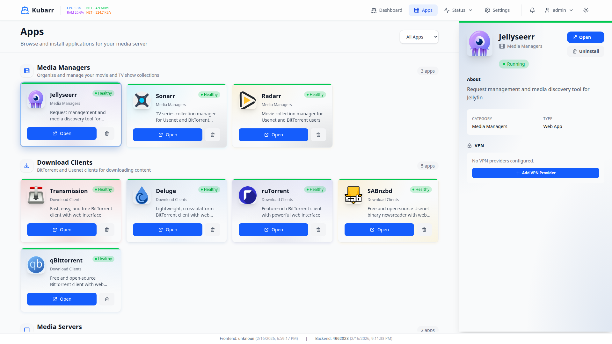

# Kubarr

[](https://opensource.org/licenses/MIT)
[](https://kubernetes.io/)
[](https://helm.sh/)
[](https://www.rust-lang.org/)

> A powerful Kubernetes application management dashboard for orchestrating and monitoring your cluster workloads


*Screenshot placeholder - Dashboard overview showing deployed applications*

## Overview

Kubarr is a Kubernetes-native application management dashboard that simplifies the deployment, configuration, and monitoring of workloads on your cluster. Built with Rust and designed for production use, Kubarr provides an intuitive interface for managing applications while maintaining the security and flexibility of Kubernetes.

## ✨ Features

- **🚀 One-Click Application Deployment** - Deploy popular applications from a curated catalog with sensible defaults
- **📊 Real-Time Monitoring** - Track resource usage, pod health, and application metrics in real-time
- **🔒 Security-First Design** - JWT authentication, role-based access control, and audit logging built-in
- **⚙️ Configuration Management** - Manage ConfigMaps, Secrets, and environment variables through an intuitive UI
- **📦 Helm Integration** - Deploy and manage Helm charts directly from the dashboard
- **🔄 Auto-Scaling Support** - Configure horizontal pod autoscaling with visual feedback
- **📝 YAML Editor** - Advanced users can directly edit Kubernetes manifests with validation
- **🌐 Multi-Cluster Ready** - Designed to support multiple cluster contexts (roadmap)
- **🔔 Smart Notifications** - Email and webhook alerts for deployment events and resource issues
- **📱 Responsive Design** - Modern, mobile-friendly interface built with best practices

## 🚀 Quick Start (Under 15 Minutes)

Get Kubarr running on your local cluster in minutes:

### Prerequisites

- Kubernetes cluster (Kind, k3s, or any K8s 1.20+)
- `kubectl` configured to access your cluster
- `helm` 3.0+ (for Helm installation)

### Option 1: Local Development with Kind (Recommended)

```bash
# 1. Create a Kind cluster (if you don't have one)
./scripts/local-k8s-setup.sh

# 2. Deploy Kubarr using the automated script
./scripts/deploy.sh

# 3. Port forward to access the dashboard
kubectl port-forward -n kubarr svc/kubarr-frontend 8080:80

# Visit http://localhost:8080 in your browser
```

**First Login:**
- Default admin credentials will be displayed in the deployment output
- You'll be prompted to change the password on first login

### Option 2: Helm Installation

```bash
# 1. Add Kubarr namespace
kubectl create namespace kubarr

# 2. Install the Helm chart from the OCI registry
helm install kubarr oci://ghcr.io/bmartensnl/kubarr/charts/kubarr -n kubarr

# 3. Wait for pods to be ready
kubectl wait --for=condition=ready pod -l app=kubarr -n kubarr --timeout=300s

# 4. Access the dashboard
kubectl port-forward -n kubarr svc/kubarr-frontend 8080:80
```

### Option 3: Existing k3s Cluster

```bash
# 1. Ensure kubectl is configured for your k3s cluster
export KUBECONFIG=/etc/rancher/k3s/k3s.yaml

# 2. Install with Helm from the OCI registry
helm install kubarr oci://ghcr.io/bmartensnl/kubarr/charts/kubarr -n kubarr --create-namespace

# 3. Access the dashboard
kubectl port-forward -n kubarr svc/kubarr-frontend 8080:80

# Visit http://localhost:8080
```

## 📖 Documentation

- **[Quick Start Guide](./docs/quick-start.md)** - Get Kubarr running in under 15 minutes (recommended for new users)
- **[Installation Guide](./docs/installation.md)** - Detailed installation instructions for various Kubernetes distributions
- **[Configuration Reference](./docs/configuration.md)** - Complete list of configuration options and environment variables
- **[User Guide](./docs/user-guide.md)** - How to use Kubarr features effectively
- **[Architecture](./docs/architecture.md)** - System architecture and design decisions
- **[API Documentation](./docs/api.md)** - REST API reference for integrations
- **[Versioning System](./docs/versioning.md)** - Version management, release channels, and release workflow
- **[Contributing Guide](./CONTRIBUTING.md)** - How to contribute to Kubarr development
- **[Security Policy](./code/backend/SECURITY.md)** - Security practices and vulnerability reporting
- **[Developer Setup](./CLAUDE.md)** - Development environment setup and workflow

## 🏗️ Architecture

Kubarr consists of three main components:

- **Backend** (Rust/Axum) - API server with Kubernetes client integration
- **Frontend** (React/TypeScript) - Modern SPA with real-time updates
- **Database** (PostgreSQL/SQLite) - Application state and configuration storage

```
┌─────────────┐      ┌─────────────┐      ┌─────────────┐
│   Frontend  │─────▶│   Backend   │─────▶│  Kubernetes │
│   (React)   │      │   (Rust)    │      │   Cluster   │
└─────────────┘      └─────────────┘      └─────────────┘
                            │
                            ▼
                     ┌─────────────┐
                     │  Database   │
                     │  (Postgres) │
                     └─────────────┘
```

## 🛠️ Technology Stack

- **Backend:** Rust, Axum, SeaORM, Kube-rs
- **Frontend:** React, TypeScript, Tailwind CSS
- **Database:** PostgreSQL (production), SQLite (development)
- **Deployment:** Docker, Kubernetes, Helm
- **Authentication:** JWT, bcrypt, TOTP (2FA)

## 🔧 Configuration

Kubarr can be configured via environment variables or Helm chart values. Key configuration options:

```yaml
# Example Helm values
backend:
  env:
    - name: KUBARR_LOG_LEVEL
      value: "INFO"
    - name: KUBARR_DATABASE_URL
      value: "postgresql://user:pass@db:5432/kubarr"
    - name: KUBARR_JWT_SECRET
      valueFrom:
        secretKeyRef:
          name: kubarr-secrets
          key: jwt-secret
```

See [Configuration Reference](./docs/configuration.md) for the complete list of options.

## 📸 Screenshots

### Authentication & Dashboard

| Login Page | Dashboard Overview |
|------------|-------------------|
|  |  |
| *Secure authentication with JWT and optional 2FA* | *Real-time overview of cluster resources and deployed applications* |

### Application Management

| Application Catalog | Deployed Applications | Logs Viewer |
|--------------------|----------------------|-------------|
|  |  |  |
| *Browse and deploy applications from the catalog* | *Manage running applications and their resources* | *Real-time log streaming with filtering and search* |

### Advanced Features

| File Browser | User Management | Role Management |
|--------------|----------------|----------------|
|  |  |  |
| *Browse and edit ConfigMaps and Secrets* | *Manage users and their access* | *Configure RBAC roles and permissions* |

*All screenshots are placeholders - actual UI may vary. See [docs/screenshots/README.md](./docs/screenshots/README.md) for details.*

## 🤝 Contributing

We welcome contributions! Whether it's bug reports, feature requests, or code contributions, please see our [Contributing Guide](./CONTRIBUTING.md) for details.

### Development Setup

```bash
# 1. Clone the repository
git clone https://github.com/yourusername/kubarr.git
cd kubarr

# 2. Set up local Kind cluster
./scripts/local-k8s-setup.sh

# 3. Build and deploy
./scripts/deploy.sh

# For remote build server
./scripts/remote-server-setup.sh --host <REMOTE_IP> --user <USER>
./scripts/deploy.sh --remote
```

See [CLAUDE.md](./CLAUDE.md) for detailed development workflow and best practices.

## 📊 Project Status

Kubarr is under active development. Current focus areas:

- ✅ Core Kubernetes integration
- ✅ Application deployment and management
- ✅ User authentication and RBAC
- 🚧 Multi-cluster support
- 🚧 Advanced monitoring and alerting
- 📋 Plugin system for extensions

## 📜 License

This project is licensed under the MIT License - see the [LICENSE](./LICENSE) file for details.

```
MIT License

Copyright (c) 2026 Kubarr Contributors

Permission is hereby granted, free of charge, to any person obtaining a copy
of this software and associated documentation files (the "Software"), to deal
in the Software without restriction...
```

## 🙏 Acknowledgments

- Built with [Kube-rs](https://kube.rs/) - Kubernetes client for Rust
- Inspired by best practices from the Kubernetes community
- Thanks to all contributors who help make Kubarr better

## 📞 Support & Community

- **Issues:** [GitHub Issues](https://github.com/yourusername/kubarr/issues)
- **Discussions:** [GitHub Discussions](https://github.com/yourusername/kubarr/discussions)
- **Documentation:** [docs/](./docs/)
- **Security:** See [SECURITY.md](./code/backend/SECURITY.md) for vulnerability reporting

---

**Note:** Kubarr is designed to simplify Kubernetes management while maintaining security and best practices. Always review permissions and configurations before deploying to production environments.
