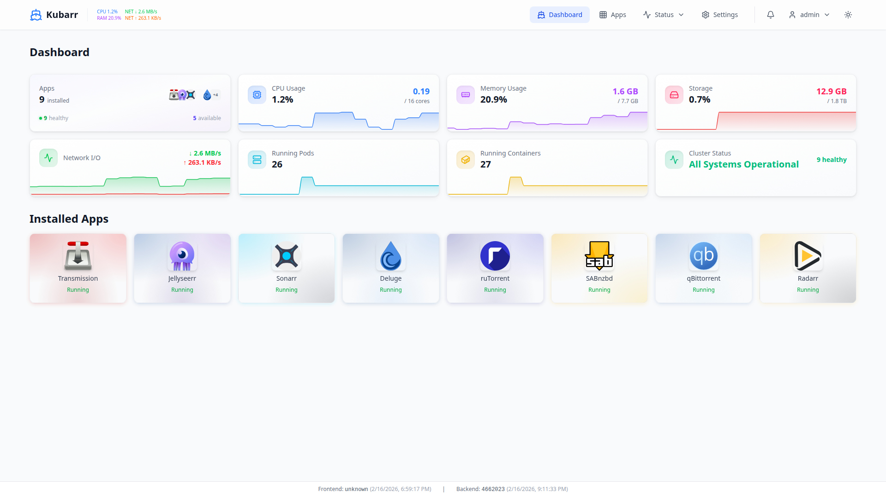
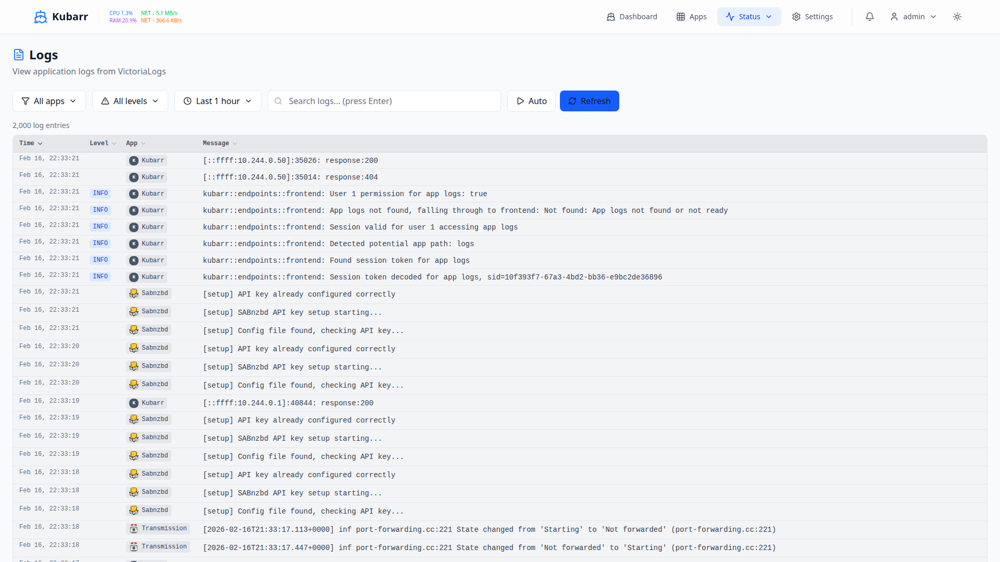

# Kubarr

<div align="center">

**Your Kubernetes Applications, Simplified**

[](https://github.com/bmartensNL/Kubarr/releases)

[Features](#-features) • [Screenshots](#-screenshots) • [Quick Start](#-quick-start) • [Documentation](./docs/)

</div>

---

## What is Kubarr?

Kubarr transforms how you manage applications on Kubernetes. No more wrestling with YAML files or memorizing kubectl commands. Deploy, monitor, and manage your applications through an intuitive dashboard that just works.

Built on Kubernetes, designed for humans.

---

## ✨ Features

### 🚀 One-Click Application Deployment

Deploy popular applications instantly with pre-configured templates. Choose from a curated catalog including media servers, download clients, automation tools, and more. Everything configured with sensible defaults—ready to use in seconds.

### 📊 Real-Time Monitoring

Watch your applications in action. See resource usage, pod health, and performance metrics updating live. Know exactly what's happening in your cluster at a glance.

### 🎛️ Configuration Made Simple

Edit environment variables, manage secrets, and update ConfigMaps through an intuitive interface. No command line required. Changes apply instantly.

### 📦 Application Catalog

Browse and deploy from a curated collection:
- **Media Servers**: Plex, Jellyfin, Emby
- **Media Management**: Sonarr, Radarr, Lidarr, Readarr
- **Indexers**: Prowlarr, Jackett, NZBHydra
- **Download Clients**: qBittorrent, SABnzbd, Transmission
- **Request Management**: Overseerr, Ombi
- **And many more...**

### 🔐 Security First

Built-in authentication with JWT tokens, role-based access control, and optional two-factor authentication. Audit logging tracks every action. Your cluster, your rules.

### 📝 Smart Log Viewer

Stream logs from any pod in real-time. Filter by severity, search across containers, and download logs for offline analysis. Debug faster with intelligent log highlighting.

### 💾 Storage Management

Visualize and manage persistent volumes. See what's using storage, free up space, and configure volume claims—all from the dashboard.

### 🌐 Networking Control

Configure services, ingress rules, and network policies visually. Port forwarding, load balancers, and DNS—no more guessing which ports are exposed.

### 🔄 Auto-Scaling Support

Set up horizontal pod autoscaling with visual feedback. Define CPU and memory thresholds and watch your applications scale automatically.

### 🔔 Smart Notifications

Get alerts when things need attention. Email and webhook notifications for deployment events, resource warnings, and application issues.

### 🎨 Modern Interface

Dark mode, responsive design, and intuitive navigation. Works beautifully on desktop, tablet, and mobile.

---

## 📸 Screenshots

<details open>
<summary><b>Dashboard Overview</b></summary>


*See all your applications at a glance. Resource usage, pod status, and quick actions in one unified view.*

</details>

<details>
<summary><b>Application Catalog</b></summary>


*Browse and deploy applications with one click. Pre-configured templates make deployment effortless.*

</details>

<details>
<summary><b>Live Monitoring</b></summary>



*Real-time metrics for CPU, memory, network, and storage. See your cluster's health at a glance.*

</details>

<details>
<summary><b>Log Viewer</b></summary>



*Stream logs in real-time with intelligent filtering and search. Debug issues faster with syntax highlighting.*

</details>

<details>
<summary><b>Configuration Management</b></summary>


*Edit environment variables and secrets through an intuitive interface. Changes apply instantly.*

</details>

<details>
<summary><b>Storage Overview</b></summary>


*Visualize persistent volumes and their usage. Manage storage claims and see what's taking up space.*

</details>

---

## 🚀 Quick Start

Get Kubarr running in under 5 minutes:

### Option 1: Helm Installation (Recommended)

```bash
# Add the Kubarr namespace
kubectl create namespace kubarr

# Install with Helm
helm install kubarr oci://ghcr.io/bmartensnl/kubarr/charts/kubarr -n kubarr

# Wait for pods to start
kubectl wait --for=condition=ready pod -l app=kubarr -n kubarr --timeout=300s

# Access the dashboard
kubectl port-forward -n kubarr svc/kubarr-frontend 8080:80
```

Open http://localhost:8080 in your browser. Default credentials will be shown during installation.

### Option 2: Local Development

```bash
# Clone the repository
git clone https://github.com/bmartensNL/Kubarr.git
cd Kubarr

# Create a local Kind cluster
./scripts/local-k8s-setup.sh

# Deploy Kubarr
./scripts/deploy.sh

# Access at http://localhost:8080
```

That's it! You're ready to start deploying applications.

---

## 💡 Why Kubarr?

**Before Kubarr:**
```bash
# Find the deployment
kubectl get deployments -n media

# Edit the config
kubectl edit deployment sonarr -n media

# Check if it worked
kubectl rollout status deployment/sonarr -n media

# View logs
kubectl logs -f deployment/sonarr -n media

# Oh no, wrong container...
kubectl logs -f deployment/sonarr -n media -c sonarr-exporter
```

**With Kubarr:**

Click your application → Adjust settings → Hit save. Done.

Logs, metrics, and configuration all in one place. No memorizing commands. No YAML formatting headaches.

---

## 🎯 Who is Kubarr For?

- **Homelab Enthusiasts** - Simplify managing your self-hosted applications
- **Media Server Users** - Deploy and manage your entire *arr stack effortlessly
- **DevOps Teams** - Give your team a user-friendly Kubernetes interface
- **Kubernetes Learners** - Understand cluster operations through a visual interface
- **Small Teams** - Reduce operational overhead with simplified management

---

## 🌟 What Makes Kubarr Different?

**Focused on Applications, Not Infrastructure**

While tools like Kubernetes Dashboard show every resource in your cluster, Kubarr focuses on what matters most: your applications. Deploy, configure, and monitor apps without getting lost in technical details.

**Pre-Configured Templates**

No need to write Helm charts or understand Kubernetes manifests. Our application catalog includes tested configurations that just work.

**Built for Humans**

Every feature designed with usability in mind. Clear error messages, intuitive workflows, and helpful tooltips guide you through every action.

---

## 📖 Documentation

- **[Quick Start Guide](./docs/quick-start.md)** - Get running in 15 minutes
- **[Installation Guide](./docs/installation.md)** - Detailed setup instructions
- **[Configuration Reference](./docs/configuration.md)** - Customize your installation
- **[User Guide](./docs/user-guide.md)** - Learn all features
- **[Development Guide](./docs/development.md)** - Contribute to Kubarr
- **[Versioning System](./docs/versioning.md)** - Version management and releases

---

## 🛟 Support & Community

- **Found a bug?** [Open an issue](https://github.com/bmartensNL/Kubarr/issues)
- **Have a question?** [Start a discussion](https://github.com/bmartensNL/Kubarr/discussions)
- **Security concern?** See [SECURITY.md](./code/backend/SECURITY.md)

---

## 🤝 Contributing

We welcome contributions! Whether it's:
- 🐛 Bug reports and fixes
- ✨ New features and enhancements
- 📝 Documentation improvements
- 💡 Feature suggestions

See our [Development Guide](./docs/development.md) to get started.

---

<div align="center">

**Ready to simplify your Kubernetes experience?**

[Get Started](#-quick-start) • [View Documentation](./docs/) • [Join Community](https://github.com/bmartensNL/Kubarr/discussions)

</div>
