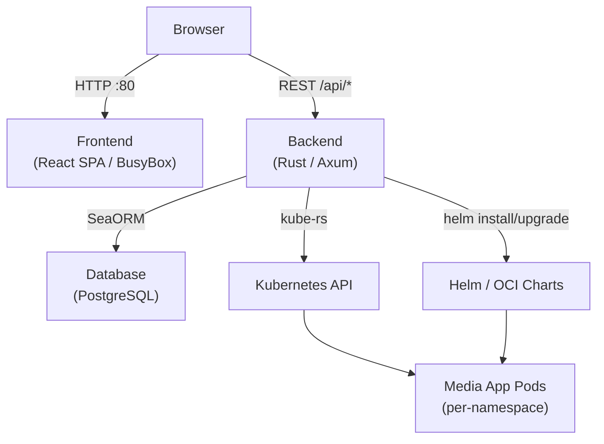
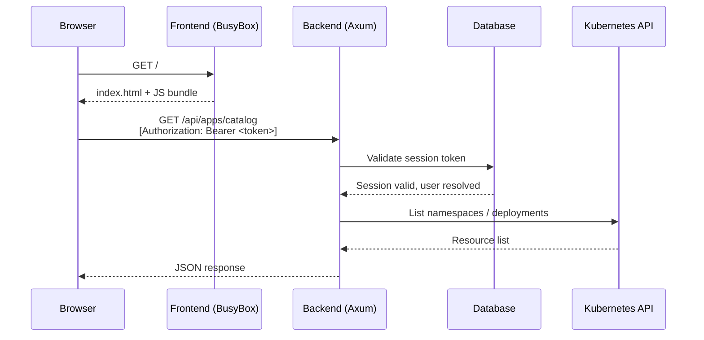
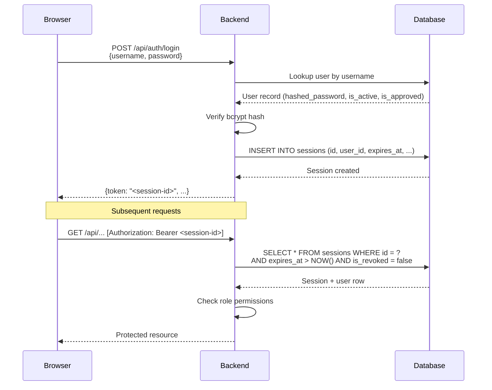
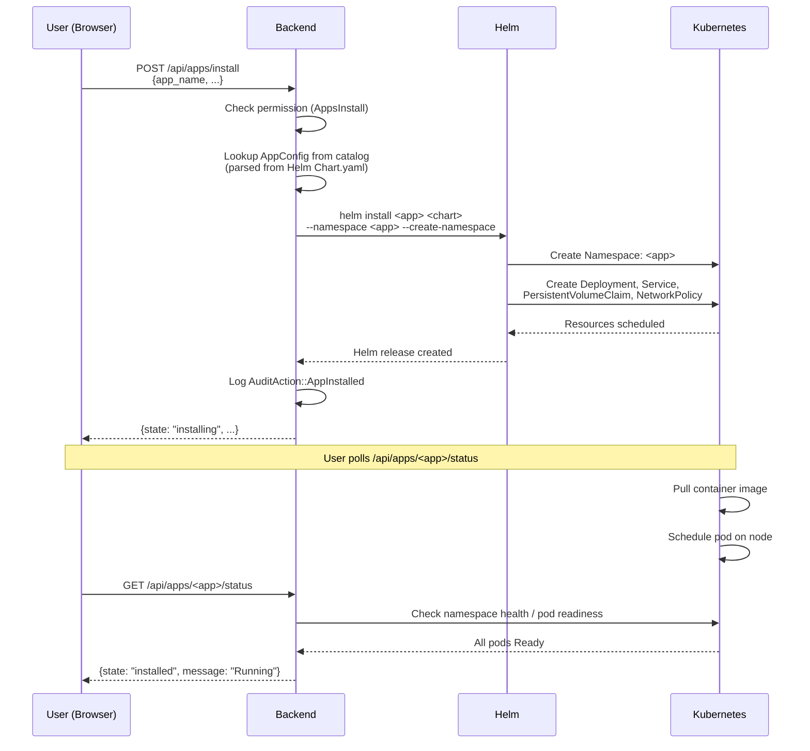
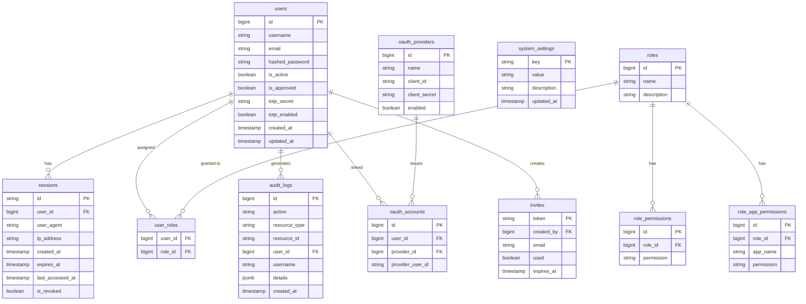

# Kubarr Architecture

This document describes Kubarr's system architecture, component relationships, and data model.

## Component Overview

Kubarr consists of four main components:

| Component | Technology | Role |
|-----------|-----------|------|
| **Frontend** | React, TypeScript, Tailwind CSS, served by BusyBox httpd | Single-page application; provides the dashboard UI |
| **Backend** | Rust, Axum, SeaORM, kube-rs | REST API server; orchestrates Kubernetes and database operations |
| **Database** | PostgreSQL (production) / SQLite (development) | Stores users, sessions, roles, audit logs, and settings |
| **Kubernetes** | kube-rs client, Helm | Deploys and manages media application workloads |

### System Diagram

---

## Request Flow

A typical authenticated API request:

---

## Authentication Flow

Kubarr uses session tokens stored in the database. JWT-style tokens are issued at login and validated on every request.

**2FA (TOTP) flow:** After password verification, if `totp_enabled = true` the server creates a `pending_2fa_challenge` record and returns a `requires_2fa` response. The client then submits the TOTP code to `/api/auth/2fa/verify` which validates the TOTP secret and completes session creation.

---

## App Deployment Flow

When a user installs a media application from the catalog:

---

## Data Model Overview

The following ER diagram covers the core entities. Notification and VPN tables are omitted for brevity.

---

## Security Architecture

- **Namespace isolation** — each installed application runs in its own Kubernetes namespace, preventing lateral movement between apps.
- **RBAC** — every API endpoint requires a specific permission (e.g. `AppsInstall`, `AppsDelete`). Permissions are attached to roles; roles are assigned to users.
- **Session invalidation** — sessions can be revoked individually (`is_revoked = true`) or expired via `expires_at`. The backend validates both on every request.
- **2FA** — optional TOTP second factor enforced before session creation.
- **Audit log** — all state-changing operations (install, delete, login, settings change) are recorded in `audit_logs` with user, timestamp, and details.
- **Network policies** — Helm charts deploy Kubernetes `NetworkPolicy` resources restricting intra-cluster traffic.
