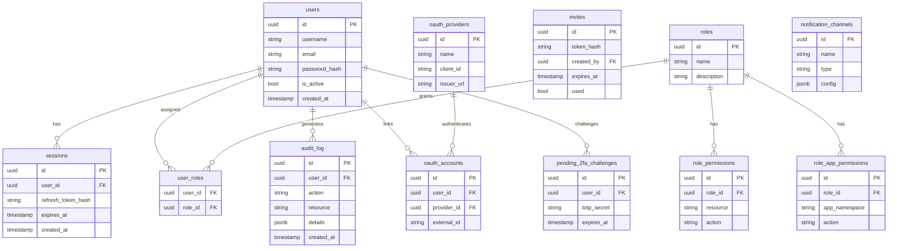

# Architecture

Kubarr is a Kubernetes-native dashboard for managing media server applications. This document covers the system design, component interactions, and data model.

## Component Overview

Kubarr consists of four main components:

| Component | Technology | Role |
|-----------|-----------|------|
| **Frontend** | React, TypeScript, Tailwind CSS | Single-page application served as static files via BusyBox/nginx |
| **Backend** | Rust, Axum, SeaORM, kube-rs | REST API server with Kubernetes client integration |
| **Database** | PostgreSQL (production), SQLite (development) | Application state, sessions, users, audit logs |
| **Kubernetes** | k3s, Kind, EKS, GKE, AKS (1.20+) | Orchestration platform for Kubarr itself and managed applications |

### Backend (Rust/Axum)

The backend is a stateless API server that:

- Handles authentication (JWT-based) and session management
- Proxies requests to the Kubernetes API via `kube-rs`
- Installs and manages media applications via Helm
- Stores application state in PostgreSQL via SeaORM
- Emits structured audit logs for all privileged operations
- Exposes REST endpoints under `/api/`

### Frontend (React/BusyBox)

The frontend is a compiled React SPA served as static files. In the Docker image, BusyBox httpd (or nginx) serves the files. The SPA communicates exclusively with the backend API — it has no direct access to Kubernetes or the database.

### Database (PostgreSQL)

PostgreSQL stores:

- User accounts, roles, and permissions
- Active sessions (JWT refresh tokens)
- Application catalog metadata
- Audit log entries
- System configuration and notification settings

Migrations run automatically at backend startup via SeaORM migrations. No manual SQL steps are required.

### Kubernetes Integration

The backend uses an in-cluster `ServiceAccount` with a `ClusterRole` to:

- List and watch namespaces, pods, deployments, services
- Create and delete namespaces for managed applications
- Install, upgrade, and uninstall Helm releases
- Read pod logs and resource metrics

---

## System Diagram

---

## Request Flow

A typical API request flows as follows:

---

## Authentication Flow

Kubarr uses JWT-based authentication with refresh tokens stored server-side.

**Key properties:**

- Access tokens are short-lived (default: 1 hour)
- Refresh tokens are stored as hashed values in the `sessions` table; the raw token is never persisted
- Logging out deletes the session record, invalidating the refresh token immediately
- 2FA (TOTP) challenges are tracked in the `pending_2fa_challenges` table before the session is created

---

## App Deployment Flow

When a user installs a media application from the catalog:

---

## Data Model Overview

### Key Entities

| Entity | Purpose |
|--------|---------|
| `users` | Human users with credentials |
| `sessions` | Active login sessions; stores hashed refresh tokens |
| `roles` | Named permission groups (e.g., Admin, Viewer) |
| `role_permissions` | Fine-grained resource/action pairs per role |
| `role_app_permissions` | Per-namespace application access per role |
| `audit_log` | Immutable record of all privileged actions |
| `invites` | Time-limited invite tokens for user registration |
| `oauth_accounts` | Links users to external OAuth2 providers |
| `pending_2fa_challenges` | Temporary TOTP challenges before session creation |
| `notification_channels` | Configured alert destinations (email, webhook, etc.) |

---

## Security Architecture

- **Namespace isolation**: Each managed application runs in its own Kubernetes namespace with `NetworkPolicy` rules preventing cross-namespace communication by default.
- **RBAC**: The backend enforces role-based access at the API level. Role permissions are loaded per-request from the database.
- **Secret management**: Sensitive values (JWT signing keys, database URLs) are stored as Kubernetes Secrets and mounted as environment variables — never in the database or in Helm `values.yaml`.
- **Non-root containers**: Both frontend and backend containers run as UID 1000 with `allowPrivilegeEscalation: false`.

## See Also

- [Configuration Reference](configuration.md) — Environment variables and Helm values
- [API Documentation](api.md) — REST API reference
- [ADR: Storage Model](adr/storage-model-architecture.md) — Architectural decision records
